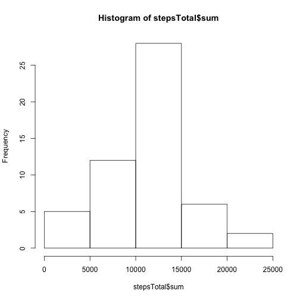
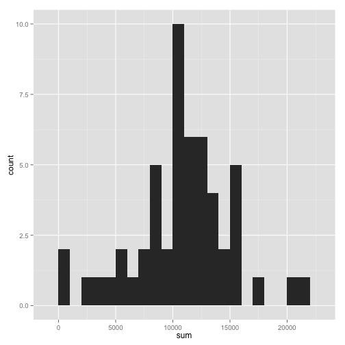
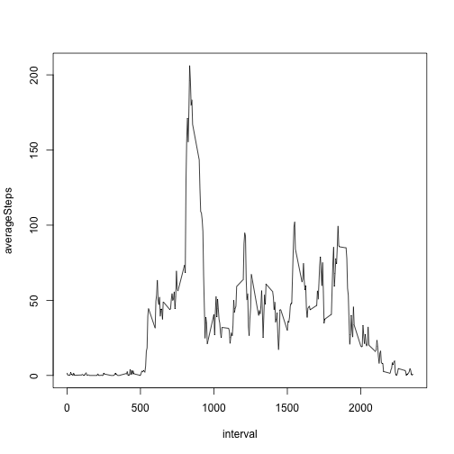
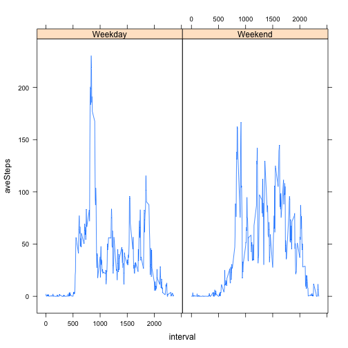

## 1. Loading and preprocessing the data

1. Load the data

```r
activity <- read.csv("./activity.csv")
```

```
## Warning in file(file, "rt"): cannot open file './activity.csv': No such
## file or directory
```

```
## Error in file(file, "rt"): cannot open the connection
```

2. Process/transform the data into a format suitable for the analysis
- convert date column from factor to date class
- remove all rows with NA's

```r
activity$date <- as.Date(activity$date)
activitySub <- na.omit(activity)
```

## 2. What is mean total number of steps taken per day?

1. Calculate the total number of steps taken per day

```r
library(dplyr)
```


```r
stepsTotal <- summarize(group_by(activitySub, date), sum = sum(steps))
stepsTotal
```

```
## Source: local data frame [53 x 2]
## 
##          date   sum
##        (date) (int)
## 1  2012-10-02   126
## 2  2012-10-03 11352
## 3  2012-10-04 12116
## 4  2012-10-05 13294
## 5  2012-10-06 15420
## 6  2012-10-07 11015
## 7  2012-10-09 12811
## 8  2012-10-10  9900
## 9  2012-10-11 10304
## 10 2012-10-12 17382
## ..        ...   ...
```

2. Make a histogram of the total number of steps taken each day.

```r
hist(stepsTotal$sum)
```

 

Here is an alternative method to creating the histogram with ggplot2:

```r
library(ggplot2)
ggplot(stepsTotal, aes(x=sum)) + geom_histogram(binwidth = 1000)
```

 

3. Calculate and report the mean and median of the total number of steps taken per day.

```r
mean <- mean(stepsTotal$sum)
median <- median(stepsTotal$sum)
mean; median
```

```
## [1] 10766.19
```

```
## [1] 10765
```

## 3. What is the average daily activity pattern?
1. Make a time series plot of the 5-minute interval and the average number of steps taken, averaged across all days

```r
intervalAverage <- summarize(group_by(activitySub, interval), averageSteps = mean(steps))
intervalAverage
```

```
## Source: local data frame [288 x 2]
## 
##    interval averageSteps
##       (int)        (dbl)
## 1         0    1.7169811
## 2         5    0.3396226
## 3        10    0.1320755
## 4        15    0.1509434
## 5        20    0.0754717
## 6        25    2.0943396
## 7        30    0.5283019
## 8        35    0.8679245
## 9        40    0.0000000
## 10       45    1.4716981
## ..      ...          ...
```

```r
with(intervalAverage, plot(interval, averageSteps, type = "l"))
```

 

2. Which 5-minute interval, on average across all the days in the dataset, contains the maximum number of steps?

```r
intervalAverage[which.max(intervalAverage$average),]
```

```
## Source: local data frame [1 x 2]
## 
##   interval averageSteps
##      (int)        (dbl)
## 1      835     206.1698
```

## 4. Imputing missing values
1. Calculate and report the total number of missing values in the dataset.  

```r
sum(is.na(activity$steps))
```

```
## [1] 2304
```

2. Devise a strategy for filling in all of the missing values in the dataset: *I will replace NA's with the mean value for that 5 minute interval.*

3. Create a new dataset that is equal to the original dataset but with the missing data filled in.


```r
library(plyr)
```


```r
impute.mean <- function(x){
        replace(x, is.na(x), mean(x, na.rm = TRUE))
        }
activityImputed <- ddply(activity, ~ interval, transform, steps = impute.mean(steps))
detach("package:plyr", unload=TRUE)
```

```
## Warning: 'plyr' namespace cannot be unloaded:
##   namespace 'plyr' is imported by 'scales', 'ggplot2', 'reshape2' so cannot be unloaded
```

These are the first rows of the data set before imputing NA's:

```r
head(activity)
```

```
##   steps       date interval
## 1    NA 2012-10-01        0
## 2    NA 2012-10-01        5
## 3    NA 2012-10-01       10
## 4    NA 2012-10-01       15
## 5    NA 2012-10-01       20
## 6    NA 2012-10-01       25
```

These are the first rows of the data set after imputing NA's.  You can see that the number of steps in the first row has changed from an NA in the original data set to 1.71, which is the interval 0 average, as observed in step 3 above.

```r
head(activityImputed)
```

```
##       steps       date interval
## 1  1.716981 2012-10-01        0
## 2  0.000000 2012-10-02        0
## 3  0.000000 2012-10-03        0
## 4 47.000000 2012-10-04        0
## 5  0.000000 2012-10-05        0
## 6  0.000000 2012-10-06        0
```


## 5. Are there differences in activity patterns between weekdays and weekends?
1. Create a new factor variable in the dataset with two levels, indicating whether a given date is a weekday or weekend day.

```r
activityImputed$weekday <- weekdays(activityImputed$date)
activityImputed$dayType <- ifelse(activityImputed$weekday %in% c("Saturday", "Sunday"), "Weekend", "Weekday")
activityImputed$dayType <- as.factor(activityImputed$dayType)
head(activityImputed)
```

```
##       steps       date interval   weekday dayType
## 1  1.716981 2012-10-01        0    Monday Weekday
## 2  0.000000 2012-10-02        0   Tuesday Weekday
## 3  0.000000 2012-10-03        0 Wednesday Weekday
## 4 47.000000 2012-10-04        0  Thursday Weekday
## 5  0.000000 2012-10-05        0    Friday Weekday
## 6  0.000000 2012-10-06        0  Saturday Weekend
```

```r
class(activityImputed$dayType)
```

```
## [1] "factor"
```

2. Make a panel plot containing a time series plot of the 5-minute interval and the average number of steps taken, averaged across all weekday days or weekend days.


```r
intervalAverage3 <- summarize(group_by(activityImputed, interval, dayType), aveSteps = mean(steps))
intervalAverage3
```

```
## Source: local data frame [576 x 3]
## Groups: interval [?]
## 
##    interval dayType    aveSteps
##       (int)  (fctr)       (dbl)
## 1         0 Weekday 2.251153040
## 2         0 Weekend 0.214622642
## 3         5 Weekday 0.445283019
## 4         5 Weekend 0.042452830
## 5        10 Weekday 0.173165618
## 6        10 Weekend 0.016509434
## 7        15 Weekday 0.197903564
## 8        15 Weekend 0.018867925
## 9        20 Weekday 0.098951782
## 10       20 Weekend 0.009433962
## ..      ...     ...         ...
```

```r
library(lattice)
xyplot(aveSteps ~ interval | dayType, data = intervalAverage3, type = "l")
```

 

